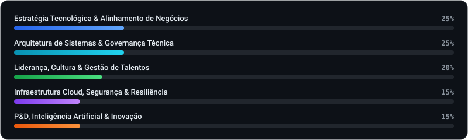

# Lucas Paulini

> *"Existe no homem um vazio do tamanho de Deus."*

Arquiteto de software e estrategista técnico com especialização em Inteligência Artificial, engenharia de sistemas e infraestrutura avançada. Cofundador e Chief Technology Officer (CTO) na AODEV Solutions. Direciono o ciclo completo de engenharia de produto: desde o desenvolvimento de serviços de alto rendimento em Python, Java e TypeScript, até a implementação de modelos de linguagem (LLMs), arquiteturas RAG com bancos de vetores e infraestrutura local de inferência em Linux. Trajetória consolidada na convergência entre liderança de equipes, eficiência computacional e resolução de problemas complexos sob pressão.

**Inteligência Artificial & Engenharia de Dados**  

  
  
  
  
  
  
  

**Sistemas & Arquitetura de Software**  

  
  
  
  
  
  

**Infraestrutura, Redes & MLOps**  

  
  
  
  
  
  

> **Nota sobre Atividade Técnica:** A maior parte das minhas contribuições diárias, arquitetura de software e desenvolvimentos da AODEV Solutions encontra-se em repositórios privados corporativos.

---

### Ecossistema de Produtos & Engenharia

| Plataforma / Solução | Domínio | Escopo & Arquitetura | Repositório |
| :--- | :--- | :--- | :--- |
| **Enterprise RAG & LLM Engine** | Inteligência Artificial / NLP | Arquitetura RAG corporativa com bancos de vetores e inferência local privada. | `Privado` |
| **AODEV Core Systems** | Arquitetura Distribuída / Back-end | Serviços de alto rendimento integrando microsserviços em Python e Node.js/TypeScript. | `Privado` |
| **Data Ingestion & Telemetria** | Engenharia de Dados / ETL | Pipelines assíncronos de extração, tratamento de dados em escala e alimentação de bancos relacionais. | `Privado` |
| **MLOps & Infrastructure Stack** | Infraestrutura Linux & Servidores | Ambientes conteinerizados, administração de redes e esteiras de automação e deploy. | `Privado` |

---

### Matriz de Atuação Técnica (CTO)

  

---

### Conecte-se e Conheça Nosso Trabalho

Transformando negócios através de engenharia de software de ponta, inteligência de dados, arquiteturas escaláveis e automações inteligentes.

  &nbsp;&nbsp;

